## EBS
* Amazon Elastic Block Store (EBS) is AWS’s easy-to-use, high-performance block storage service.

* Amazon Elastic Block Store (Amazon EBS) offers persistent storage for Amazon EC2 instances. Amazon EBS volumes are network-attached and persist independently from the life of an instance. Amazon EBS volumes are highly available, highly reliable volumes that can be leveraged as an Amazon EC2 instances boot partition or attached to a running Amazon EC2 instance as a standard block device.

* Amazon EBS Volume Features:

1-Persistent storage: Volume lifetime is independent of any particular Amazon EC2 instance.

2-General purpose: Amazon EBS volumes are raw, unformatted block devices that can be used from any operating system.

3-High performance: Amazon EBS volumes are equal to or better than local Amazon EC2 drives.

4-High reliability: Amazon EBS volumes have built-in redundancy within an Availability Zone.

5-Designed for resiliency: The AFR (Annual Failure Rate) of Amazon EBS is between 0.1% and 1%.

6-Variable size: Volume sizes range from 1 GB to 16 TB.

7-Easy to use: Amazon EBS volumes can be easily created, attached, backed up, restored, and deleted.

* Lab Overview

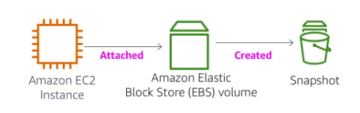

## Task 1: Create an EBS Volume

* Create Volume

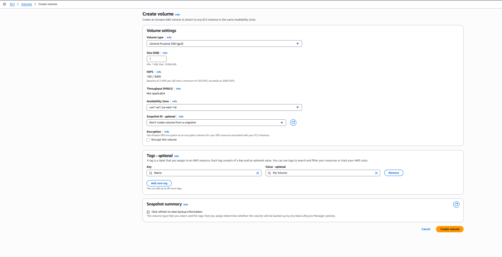

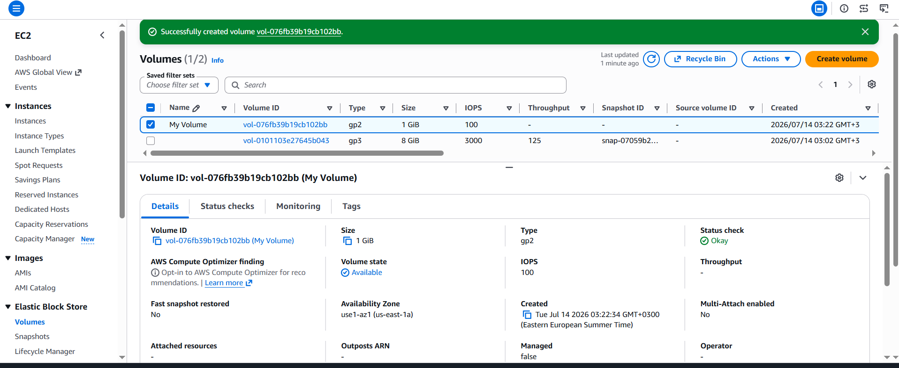

## Task 2: Attach the Volume to an Instance

 * To attach The new volume to the Amazon EC2 instance :
 Select  My Volume.

1-In the Actions menu, choose Attach volume.

2-Choose the Instance field, then select the instance.

3- The Device Name.

4-Choose Attach volume

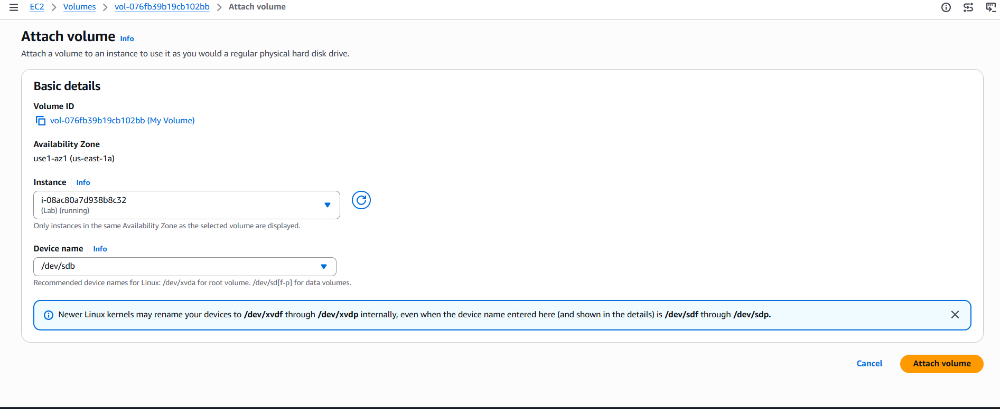

* The volume state is now In-use.

## Task 3: Connect to The Amazon EC2 Instance

1-In the AWS Management Console, in the EC2 service, choose Instances.

2-Select the instance.

3-Choose Connect

4-Choose the Session Manager tab, then choose Connect

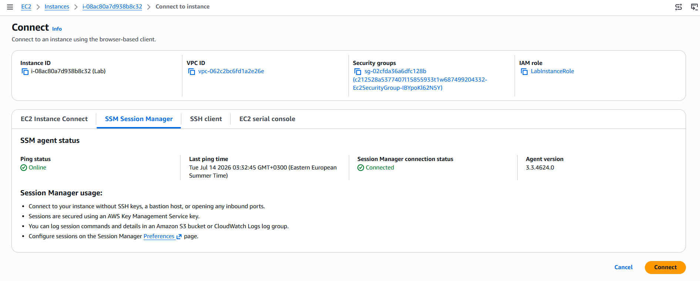

## Task 4: Create and Configure File System

* In this task,add the new volume to a Linux instance as an ext3 file system under the /mnt/data-store mount point.

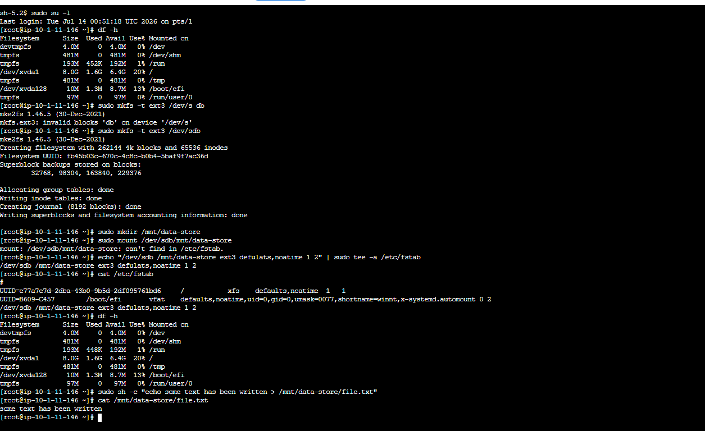

## Task 5: Create an Amazon EBS Snapshot

* VVYou can create any number of point-in-time, consistent snapshots from Amazon EBS volumes at any time. Amazon EBS snapshots are stored in Amazon S3 with high durability. New Amazon EBS volumes can be created out of snapshots for cloning or restoring backups. Amazon EBS snapshots can also be easily shared among AWS users or copied over AWS regions.

Create snapshot
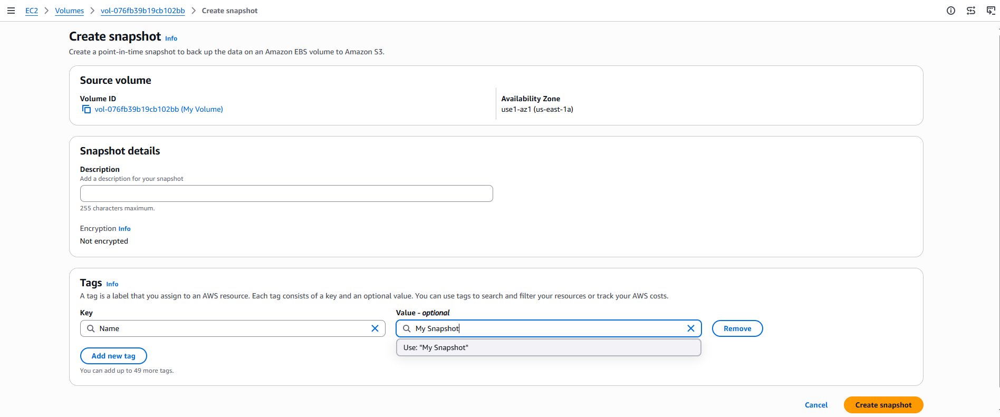

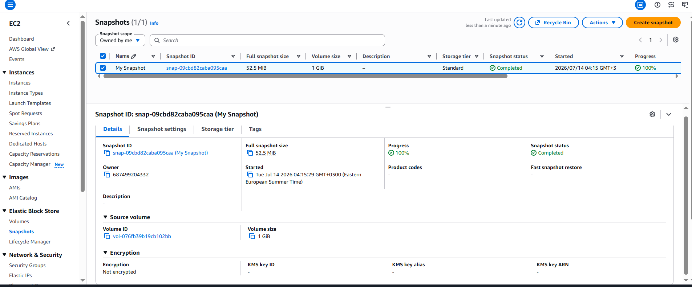

In The terminal session, delete the file that I created on My volume.

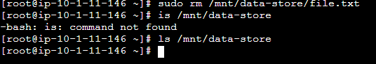

## Task 6: Restore the Amazon EBS Snapshot

* Create a Volume Using Your Snapshot
1-In the AWS Management Console, select  My Snapshot.

2-In the Actions menu, select Create volume from snapshot. 

3-For Availability Zone Select the same availability zone that you used earlier.

4-Choose Add tag then configure

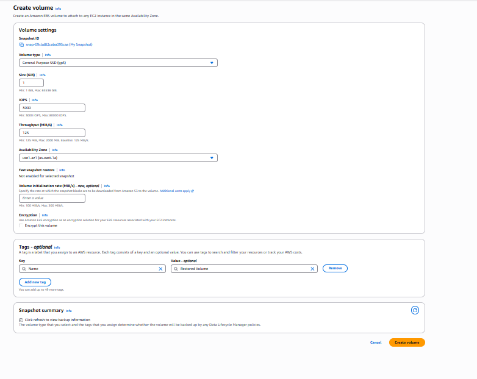

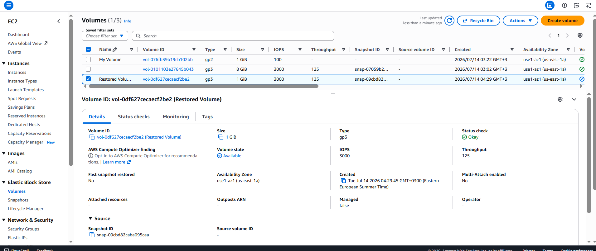

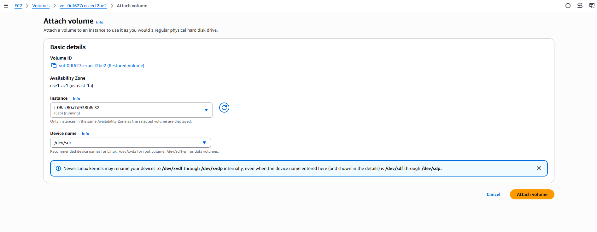

### Mount the Restored Volume

* Create a directory for mounting the new storage volume:

sudo mkdir /mnt/data-store2

* Mount the new volume:

sudo mount /dev/sdc /mnt/data-store2
 
 * Verify that volume you mounted has the file that you created earlier.

ls /mnt/data-store2/

 