# Amazon EC2
* Amazon EC2 (Elastic Compute Cloud) is one of AWS's core services. In simple terms, it allows you to rent virtual computers (called instances) in the cloud to run your own applications.

* Amazon EC2's simple web service interface allows you to obtain and configure capacity with minimal friction. It provides you with complete control of your computing resources and lets you run on Amazon's proven computing environment. Amazon EC2 reduces the time required to obtain and boot new server instances to minutes, allowing you to quickly scale capacity, both up and down, as your computing requirements change.

## Task 1: Launch Your Amazon EC2 Instance

In the AWS Management Console choose  Services, choose Compute and then choose EC2

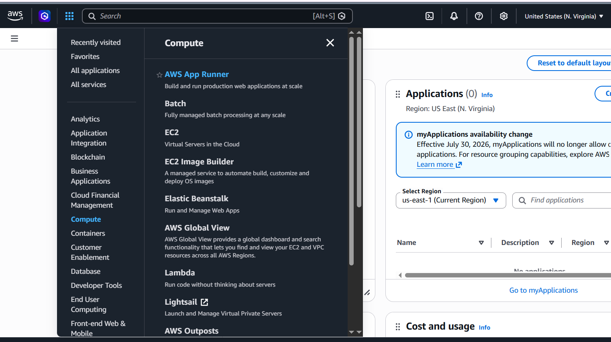

Step 1: Name and tags

Step 2: Application and OS Images (Amazon Machine Image)

Step 3: Instance type

Step 4: Key pair (login)

Step 5: Network settings

Step 6: Configure storage

Step 7: Advanced details

Step 8: Launch the instance

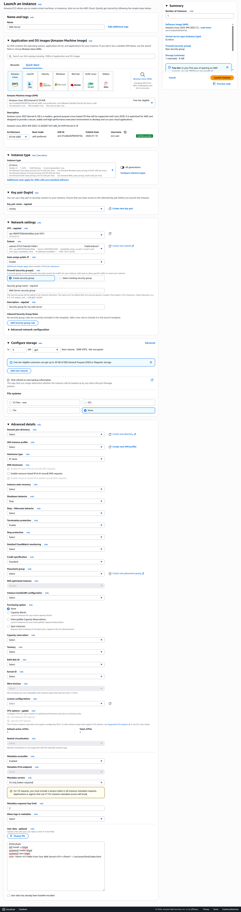
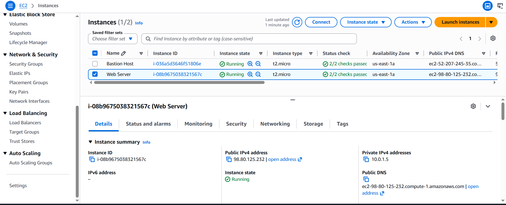

## Task 2: Monitor Your Instance

In the Actions  menu towards the top of the console, select Monitor and troubleshoot  Get system log.

System log

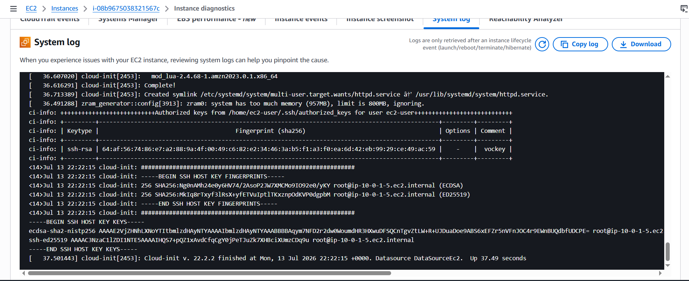

 * in the Actions  menu, select Monitor and troubleshoot  Get instance screenshot.

Instance screenshot

## Task 3: Update Your Security Group and Access the Web Server

* You are not currently able to access The web server because the security group is not permitting inbound traffic on port 80, which is used for HTTP web requests. This is a demonstration of using a security group as a firewall to restrict the network traffic that is allowed in and out of an instance.
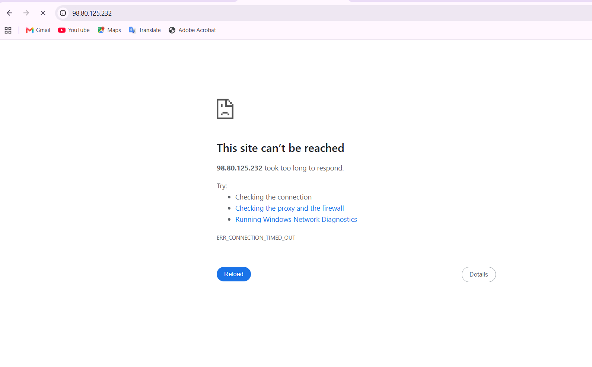
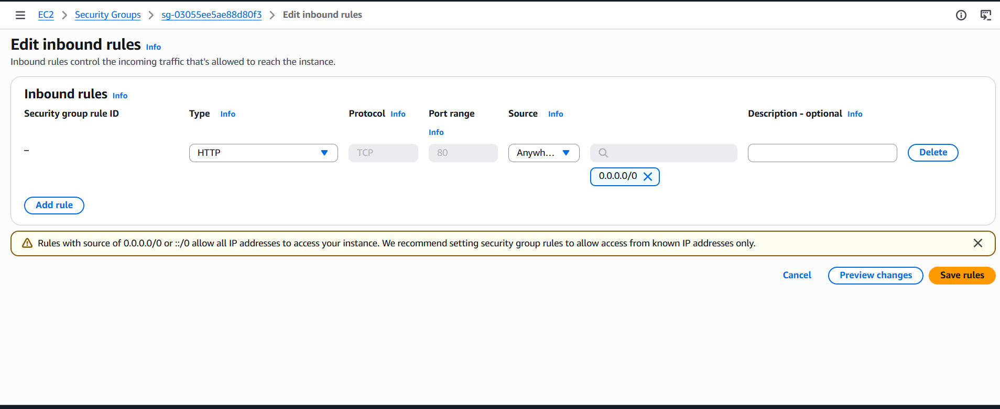
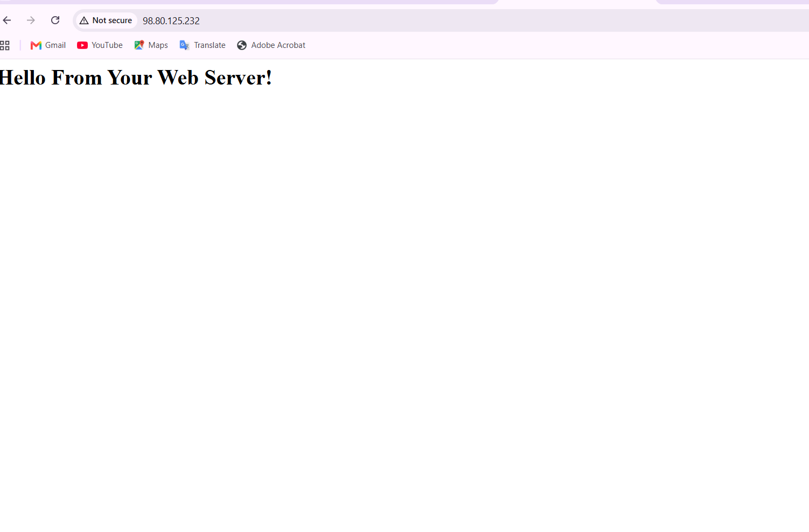

## Task 4: Resize The Instance: Instance Type and EBS Volume

* Before you can resize an instance, you must stop it.

* When you stop an instance, it is shut down. There is no runtime charge for a stopped EC2 instance, but the storage charge for attached Amazon EBS volumes remains.

Stop Instance
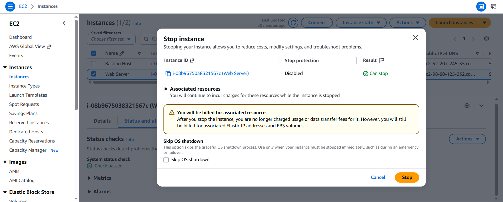

* Change The Instance Type and enable stop protection
Select the Web Server instance, then in the Actions  menu, select Instance settings  Change instance type, then configure
After the changeing Start the Resized Instance again

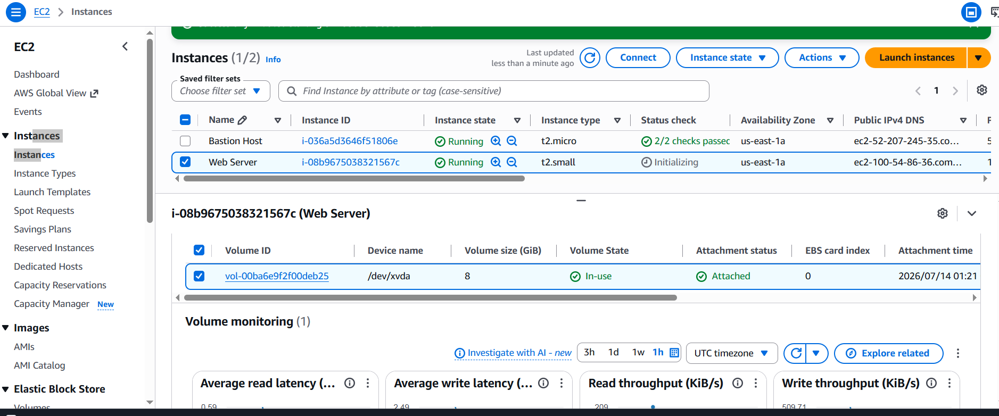

## Task 5: Explore EC2 Limits

Amazon EC2 provides different resources that you can use. These resources include images, instances, volumes, and snapshots. When you create an AWS account, there are default limits on these resources on a per-region basis.
 How to Get It : In the AWS Management Console, in the search box next to  Services, search for and choose Service Quotas
Choose AWS services from the navigation menu and then in the AWS services Find services search bar, search for ec2 and choose Amazon Elastic Compute Cloud (Amazon EC2)
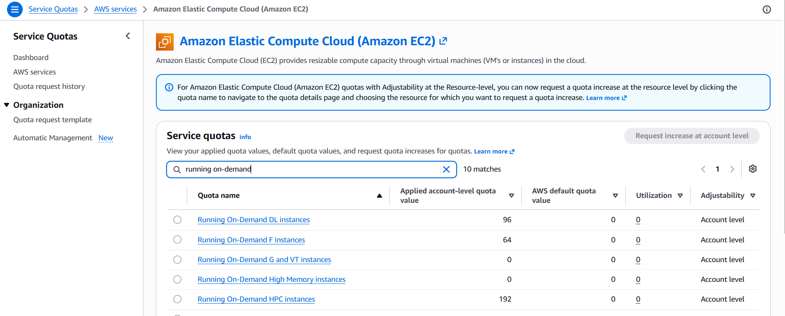

## Task 6: Test Stop Protection

 When Trying to stop the instance there is a message will appears that says: Failed to stop the instance i-1234567xxx. The instance 'i-1234567xxx' may not be stopped. Modify its 'disableApiStop' instance attribute and try again.
To stop the instance, you will need to disable the stop protection:
1-In the Actions  menu, select Instance settings  Change stop protection.
2-Remove the check next to  Enable.
3-Choose Save
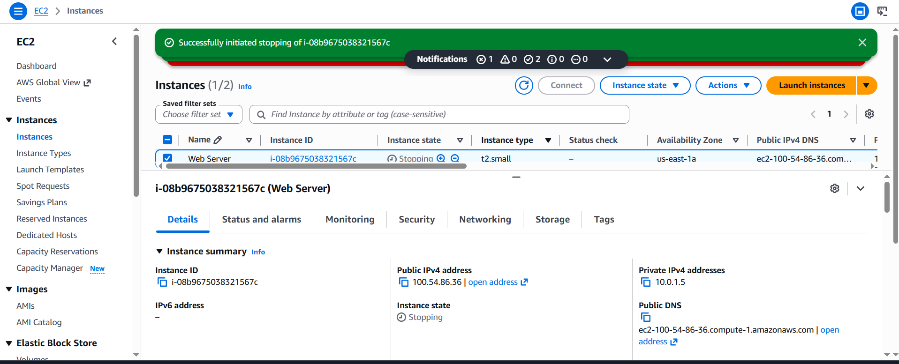