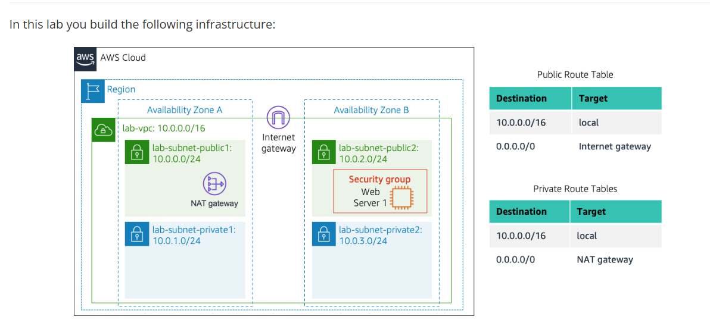

#  Build VPC and Launch a Web Server

## 📌 Project Overview
This project demonstrates how to architect an isolated, secure, and highly available virtual network on AWS from scratch, deploy a compute instance, and automate web server configuration.

---

## 🚀 Lab Implementation Steps

The core objective of this project is to architect an isolated **Virtual Private Cloud (VPC)** from scratch, divide it strategically into **Public and Private Subnets** across separate **Availability Zones (AZs)**, and deploy an automated, public-facing **Apache Web Server** using bootstrap scripting via **EC2 User Data**. Security constraints are tightly managed using stateful **VPC Security Groups** to enforce the principle of least privilege.

---

## 🏗️ Task 1: Create Your VPC
* I created a custom Virtual Private Cloud (VPC) to serve as an isolated cloud environment. I configured the network components to split it into a Public Subnet (connected directly to the internet via an Internet Gateway) and a Private Subnet (isolated from the internet, but using a NAT Gateway for outbound connectivity).

### Task 2: Create Additional Subnets
* To ensure high availability and eliminate single points of failure, I expanded the network by adding two more subnets (one public and one private) in a completely different Availability Zone. Then, I updated the Route Tables to associate the new subnets and manage data routing properly across both zones.

---

## 🛠️ Task 3: Create a VPC Security Group
*  TO establish a security boundary by creating a custom VPC Security Group. I configured inbound rules to act as a virtual firewall, explicitly permitting HTTP traffic over port 80 so internet users can access the website, while keeping all other ports securely closed.

---

## 🚀 Task 4: Launch a Web Server Instance
* I deployed an Amazon Linux EC2 compute instance into the second public subnet and assigned it the custom Security Group. To automate production setup, I injected a Bash bootstrap script into the User Data panel; this script automatically installs Apache, PHP, downloads the website files, and starts the web service upon initial boot.

## 🏁 Conclusion
* This lab successfully bridges the gap between traditional networking concepts and modern Cloud Infrastructure. By architecting a multi-AZ VPC completely through software, this implementation successfully demonstrates how to secure application boundaries using public/private subnets, control baseline traffic via stateful firewalls, and completely automate compute provisioning using EC2 User Data bootstrap scripts. The resulting topology provides a scalable, highly available, and robust environment ready to host resilient cloud applications.
